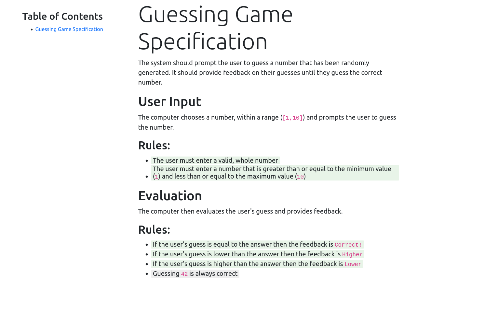

# guess-demo-node

A node.js and Jest based demo of [blprnt](https://blprnt.tech) - the specification verification system.

Usage
------

```shell
$ npm i
$ npm test
$ cd spec
$ blprnt preview --tests "../test/reports"
```

The verified specification:

